# Welcome to the make your first game workshop!

By the end of this workshop, you should hopefully have created a small platformer game with basic enemies.

The below instructions will guide you through creating this platformer game, feel free to follow them as strictly or loosely as you want!

# Index

1. [Downloading the workshop](#1-downloading-the-workshop),

    1.1. [If you do not know your User ID](#11-if-you-do-not-know-your-user-id),

2. [Opening the project](#2-opening-the-project),

3. [Getting to grips with Unity](#3-getting-to-grips-with-unity),

    3.1. [The Hierarchy](#31-the-hierarchy),

    3.2. [Play / Pause](#32-play--pause),

    3.3. [The Inspector](#33-the-inspector),

    3.4. [Scene View](#34-scene-view),

    3.5. [Project View](#35-project-view),

4. [Creating a Player](#4-creating-a-player),

    4.1. [Creating the main Player object](#41-creating-the-main-player-object),

    4.2. [Creating the Player's MonoBehaviour script](#42-creating-the-players-monobehaviour-script),

    4.3. [A brief overview of the structure of a MonoBehaviour script](#43-a-brief-overview-of-the-structure-of-a-monobehaviour-script),

    4.4. [Reading input from the Unity Input System](#44-reading-input-from-the-unity-input-system),

    4.5. [Using input to move the Player](#45-using-the-input-to-move-the-player),

5. [Creating something for the Player to stand on](#5-creating-something-for-the-player-to-stand-on),

    5.1. [Making some ground](#51-making-some-ground),

    5.2. [Extension: Preventing double jumping](#52-extension-preventing-double-jumping),

## 1. Downloading the workshop

To download the project from this GitHub page, first select `Code`, and then `Download ZIP`, as shown below.

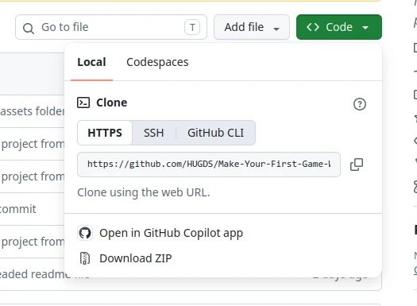

In the download prompt that appears, change the download destination such that it downloads to the folder `C:\Users\XXXXXX\workspace`, where `XXXXXX` is your six digit User ID.

Unlike your documents, downloads, etc folders, this folder exists locally on the machine you are currently working on, with the contents of it being deleted after around three days.

Once downloaded, unzip the downloaded ZIP file and move onto the next section.

### 1.1. If you do not know your User ID

If you do not know your User ID, you can find it out by visiting [this](https://evision.hull.ac.uk/) website, logging in with your student email and then selecting `my Details` from the leftmost menu.


On the page that shows up, your User ID will be shown in the field titled `User ID`, an example is shown below:

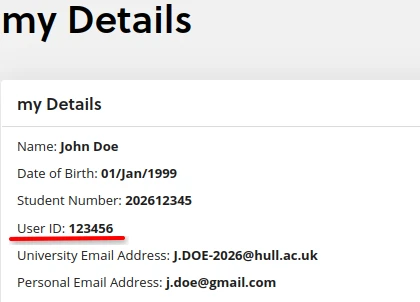

## 2. Opening the project

To then open the project, first start by opening the Unity Hub, which can be found via searching for it within the start menu.

Once open, you should be greeted by a screen similar to this one:

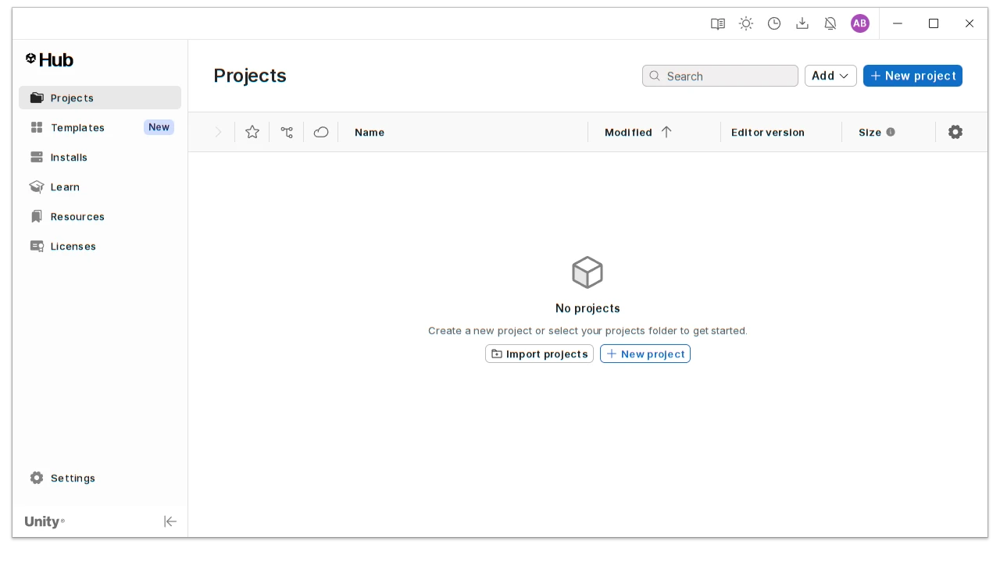

From here either select `Import projects` or `Add` &rarr; `Add project from disk`.

In the file select prompt that shows up, navigate to the folder that was extracted in the previous step and select that.

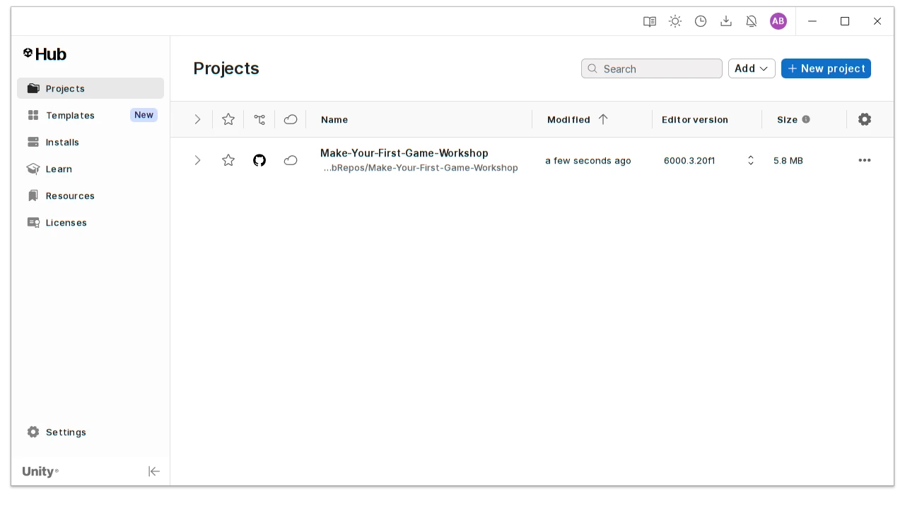

The Unity Hub should now show the project, from which the project can be clicked on to begin opening it in Unity.

## 3. Getting to grips with Unity

Once the project is open, Unity should look something similar to what is seen below. If you are already familiar with Unity, you are welcome to skip this section as it will simply give a brief overview of the Unity UI.

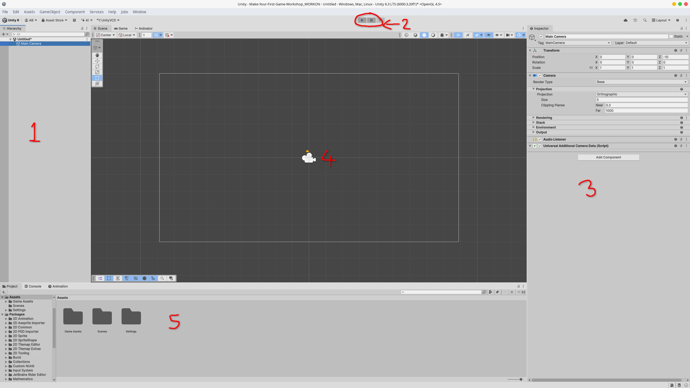

### 3.1. The Hierarchy

The hierarchy shows a tree view of all GameObjects currently in the scene, along with the scene name, which for this is currently `Untitled`. From the hierarchy, objects can be selected, which will then show up in [the Inspector](#33-the-inspector).

### 3.2. Play / Pause

These two buttons allow you to test your game. Pressing the play button will switch the editor to `Play Mode` and begin running the game, and when pressed during `Play Mode`, the play button will swap the editor back out of `Play Mode`. The pause button pauses `Play Mode`, allowing for you to look at the state of objects in the scene whilst the game is running.

### 3.3. The Inspector

The inspector shows a list of all components currently on the GameObject that is currently selected in [the Hierarchy](#31-the-hierarchy). It also allows for you to change component values on the selected GameObject.

### 3.4. Scene View

The scene view shows the currently active scene, and will swap to the game view when `Play Mode` is started by pressing [the Play](#32-play--pause) button.

### 3.5. Project View

The project view is a directory view of all files in the project. By default it shows the root of the `Assets` folder.

## 4. Creating a Player

### 4.1. Creating the main Player object

Before starting work on a Player, make sure that the currently open scene is `Main`. This scene can be found in [the Project View](#35-project-view) under the path `Assets` &rarr; `Scenes`.

As with every great Unity game, it starts with a cube (in this case a 2D cube, called a square). In [the Hierarchy](#31-the-hierarchy), right click and select `2D Object` &rarr; `Sprites` &rarr; `Square`.

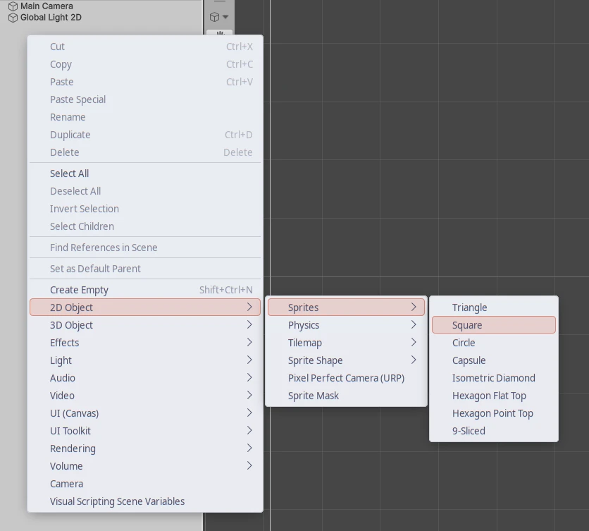

Once created, you will be able to type out a name for it, name it something appropriate, for this workshop this object will be named `Player`.

As the Player will be our character, they will need to be able to move and collide with other things in the scene. To do this, the Player will need a `Rigidbody 2D` and a `Box Collider 2D`.

To do this, click `Add Component` in [the Inspector](#33-the-inspector) with the Player object selected in [the Hierarchy](#31-the-hierarchy) and then search for `Rigidbody 2D`. Click it when it appears in the search.

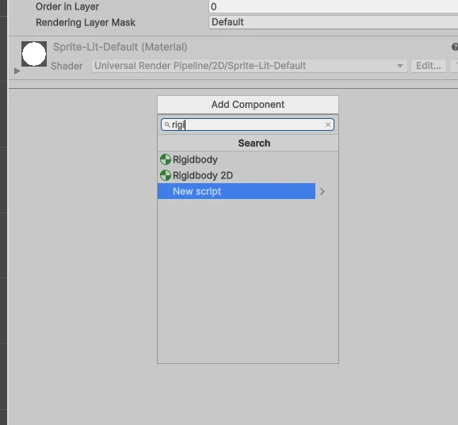

Once created, a new component like shown below should appear:

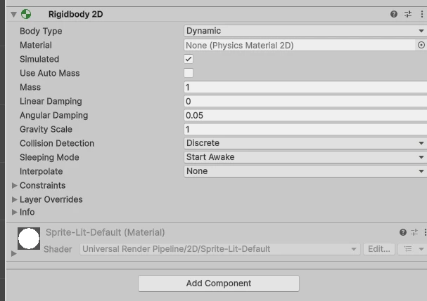

To prevent the Player from spinning in circles when they start moving later on in the workshop, go to `Constraints` within the Rigidbody 2D and toggle `Freeze Rotation` `Z`.

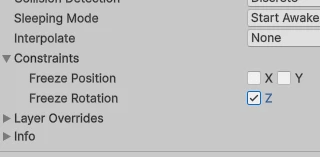

Next, follow the same process to add a `Box collider 2D` component to the Player object.

At this point you are welcome to press [the Play button](#32-play--pause) to see what you've made. If you see the Player begin to fall towards the bottom of the screen and then off the screen, congratulations! Otherwise, feel free to ask one of the society execs if you are unsure why this is not happening, or even if you just want any piece of what you've just done explaining in more detail.

### 4.2. Creating the Player's MonoBehaviour script

Next, the movement for the Player will be created. To do this a MonoBehaviour script will need to be created. To do this, go to [the Project View](#35-project-view) and right click, then select `Create` &rarr; `MonoBehaviour Script`. For this workshop, the script will be placed inside a folder named `Script`, which can be created by right clicking in [the Project View](#35-project-view) and selecting `Create` &rarr; `Folder`.

Name the MonoBehaviour script something appropriate, for this tutorial the name `Player_Move` will be used. Once created and named, double click on the new script to open it in Visual Studio.

```csharp
using UnityEngine;

public class Player_Move : MonoBehaviour
{
    // Start is called once before the first execution of Update after the MonoBehaviour is created
    void Start()
    {
        
    }

    // Update is called once per frame
    void Update()
    {
        
    }
}
```

The created script should be the same as shown above. All MonoBehaviour scripts follow the same structure as seen here.

### 4.3. A brief overview of the structure of a MonoBehaviour script

All MonoBehaviour scripts define a single MonoBehaviour class, which follows the format of:

```csharp
public class CLASSNAME : MonoBehaviour
{
...
```

Which means that this class ***is a*** MonoBehaviour class and as such inherits methods and attributes such as the two shown below:

```csharp
...
// Start is called once before the first execution of Update after the MonoBehaviour is created
void Start()
{
    
}

// Update is called once per frame
void Update()
{
    
}
...
```

These two methods are provided by Unity, with the first one `Start` being called on the first frame of the scene being run, and `Update` being called on every subsequent frame.

### 4.4. Reading input from the Unity Input System

Remember when you created the `Rigidbody 2D` and `Box Collider 2D` components on the Player object? Well now you need a way to interact with the `Rididbody 2D` from within the Player's script. To do this, create a variable of type `Rigidbody2D` as shown below and mark it with `[SerializeField]`:

```csharp
public class Player_Move : MonoBehaviour
{
    // Editor Variables
    [SerializeField]
    private Rigidbody2D _rigidBody;
...
```

The tag `[SerializeField]` tells Unity that this variable should be modifiable via the inspector. In fact, let's do that right now. Go back to Unity and on the Player object add the created MonoBehaviour component the same way that the other two components were added (it will show up with the same name that you gave the script).

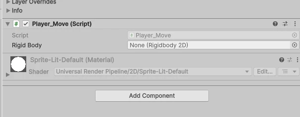

As can be seen above, the variable that was added in the script has now appeared as a field on the `Player_Move` component, with its name being a 'pretty-printed' version of the variable name in the script. From here, either drag the `Rigidbody 2D` component onto the `Rigid Body` field or click on the `+` on the field and select `Player` from the menu that appears. The field should now be populated with the Player's rigidbody component.

Next, a way for the Player to detect input should be added. For this workshop, the built-in Unity Input System will be used. Create a pair of variables for holding references to the Input System's built in 'Move' and 'Jump' actions. To modify or view these actions within Unity, navigate to the title bar and select `Edit` &rarr; `Project Settings...` &rarr; `Input System Package`.

```csharp
private Rigidbody2D _rigidBody;

// Private Variables
private InputAction _move;
private InputAction _jump;
...
```

Unity's Input System works with 'Actions' and 'ActionMaps', where a named 'ActionMap' contains a set of named 'Actions', which abstract keyboard / controller / touch input to simple numerical inputs. As an example, the default 'Move' 'Action' within the 'Player' 'ActionMap' returns a 'Vector2' (An X/Y value) from either the left stick on a Gamepad, W,A,S,D, the stick on a Joystick or a 2D axis on an XR controller.

```csharp
void Start()
{
    // Fetch the input action map named "Player"
    InputActionMap map = InputSystem.actions.FindActionMap("Player");

    // Fetch the actions named "Move" and "Jump"
    _move = map.FindAction("Move");
    _jump = map.FindAction("Jump");
}
```

To fetch a reference to these actions, the code above is used, where the `Player` 'ActionMap' is fetched and stored so that it can then be used to fetch the `Move` and `Jump` actions, which are then stored in the variables that were declared earlier.

```csharp
// Update is called once per frame
void Update()
{
    // Poll Move and Jump actions
    Vector2 moveAction = _move.ReadValue<Vector2>();
    bool jumpAction = _jump.WasPressedThisFrame();
}
```

To then read from these actions, the method `ReadValue` is used to return a value of the same type as the action. For the `Move` action this is a `Vector2` as it contains both X and Y components. For the jump action, you only want it to do a jump when the button is pressed rather than held though, and for this Unity provides a built-in method (`WasPressedThisFrame`) that returns either `true` or `false` for whether the button was pressed on this frame.

**Extension:** If you are already quite familiar with C# programming, you may be familiar with the concept of events and observer based programming. Unity's Input System supports this programming paradigm by exposing the `performed` event on the type `InputAction` that is called when the action is performed. Have a go at replacing this per-frame polling with the less expensive event-based input for the `Jump` action.

### 4.5. Using input to move the Player

```csharp
// Update is called once per frame
void Update()
{
    // Poll Move and Jump actions
    Vector2 moveAction = _move.ReadValue<Vector2>();
    bool jumpAction = _jump.WasPressedThisFrame();

    // Do jump
    if (jumpAction)
    {
        // Add force to rigidbody
        _rigidBody.AddForceY(500);
    }
}
```

To then apply movement to the player is fairly simple. Firstly, the `Jump` action can be dealt with by checking if it was pressed this frame, and if it was, the `RigidBody2D` that we stored a reference too earlier can be used to apply an upwards force to the Player via the `AddForceY` method.

```csharp
// Update is called once per frame
void Update()
{
    ...
    // ^ Jump action handling and action polling

    // Do movement
    gameObject.transform.position = new Vector3
        (
            gameObject.transform.position.x + 10 * moveAction.x * Time.deltaTime,
            gameObject.transform.position.y,
            gameObject.transform.position.z
        );
}
```

The same force-based approach could be taken for the Player's movement, however in a platformer game, generally players like to have snappy control over their character's movement, and to do this the `Transform` component of the Player can be directly accessed to modify its position.

In the above code, all that is happening is that the Y and Z co-ordinates of the position are being kept the same, whilst the movement action's left-right value is being used to add or subtract from the Player's X position, to move them left and right.

The `Time.deltaTime` component is a built-in Unity value that returns a value, which if you were to poll every `Update` for a second, would sum to 1. Multiplying by this means that regardless of the framerate that the game is running at, the Player's movement should not become faster or slower.

**Extension:** Have a go at replacing this snappy movement with force-based left-right movement.

## 5. Creating something for the Player to stand on

### 5.1. Making some ground

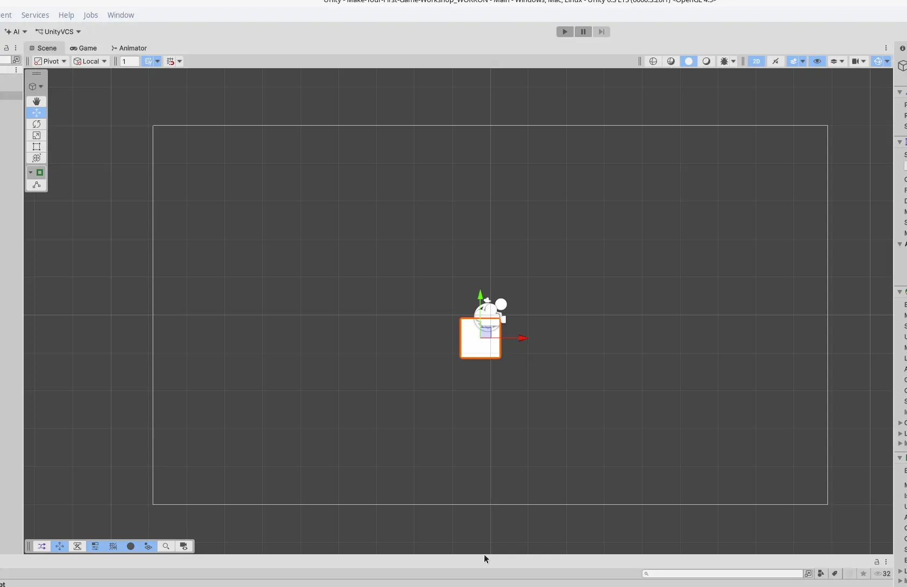

If you've been returning to the Unity Editor to run and test your code as you've been working through the prior section, you may have realized that the Player tends to fall into the abyss below the bottom of the screen. In this part of the workshop, ground to stand on will be added.

Similar to creating the player, the ground can be made out of squares. To do this, simply follow the same process as was done for creating the Player object, then drag and scale the square to where you want the ground to be. In the example shown below the square has been placed at (0.06, -4.06) and has been scaled to (20, 1).

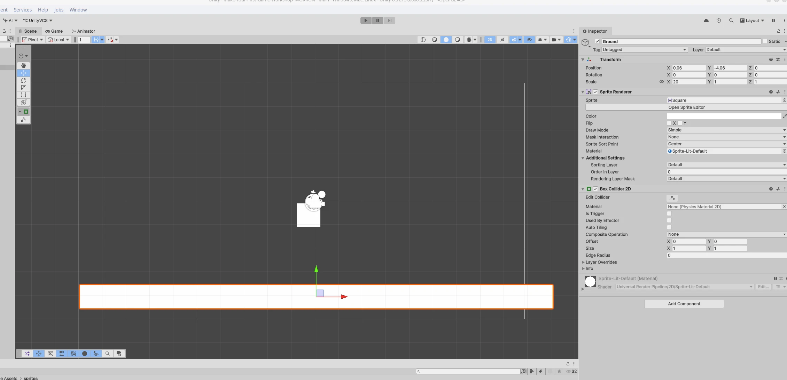

Don't forget to also give the ground a box collider, so that the Player can collide with it!

From this point feel free to tweak the Player's jump height and add more boxes to create platforms. For the rest of this workshop, the ground will look like this:

### 5.2. Extension: Preventing double jumping

You may have noticed that the Player can jump whenever they want, regardless of whether they are on the ground or not. To work around this, the ever-useful Box Collider 2D can be used to add ground detection. To do this, we can add a child to the Player object by selecting the Player and then right clicking on them in [the Hierarchy](#31-the-hierarchy) and selecting `Create Empty`. Name the object something appropriate such as `FloorCheck`.

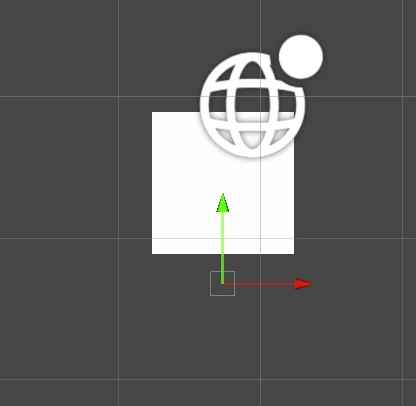

With the new object selected, navigate to [the Scene View](#34-scene-view) and drag the green arrow such that the object appears slightly below the player. Next we'll add a `Box Collider 2D` to the object.

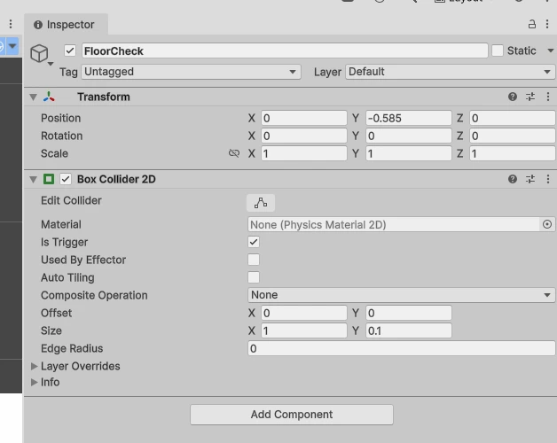
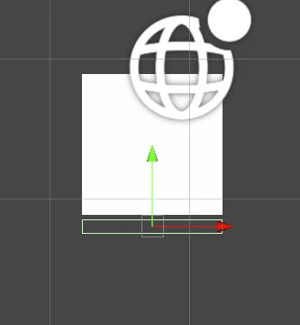

Enable the `Is Trigger` field of the Box Collider and then move and scale it such that the collider is slightly below the bottom of the Player object and spans the width of the Player.

Next make a new MonoBehaviour script and name it something appropriate such as `Player_FloorCheck`. This script will use the built in methods provided from the Box Collider to detect when this object is colliding with something.

```csharp
using UnityEngine;

public class Player_FloorCheck : MonoBehaviour
{
    // Private Variables
    private bool _floored = false;
    private int _collisionCount = 0;

    // Called when something collides with this object
    private void OnTriggerEnter2D(Collider2D collision)
    {
        // Add one to the number of current collisions
        _collisionCount++;

        // Check if we are now on the floor
        AmFloored();
    }
    // Called when something stops colliding with this object
    private void OnTriggerExit2D(Collider2D collision)
    {
        // Subtract one to the number of current collisions
        _collisionCount--;

        // Check if we are still on the floor
        AmFloored();
    }

    // Figures out whether we are standing on anything
    private void AmFloored()
    {
        // Are there any things colliding with this object?
        if (_collisionCount > 0)
        {
            // Then we must be floored
            _floored = true;
        }
        // Otherwise
        else
        {
            // We cannot be on the floor anymore
            _floored = false;
        }
    }

    // Fields
    public bool Floored { get { return _floored; } }
}
```

Paste the above code into the newly created script. Take some time to read over the comments to figure out what the code is doing. If you are unsure about what the code is doing at any point, feel free to reach out to one of the society execs at the workshop, who will be happy to help you with understanding what the code is doing.

Once you feel comfortable that you know what the code is doing, return to Unity and add this newly created script to the object in the same way as the Player's movement script was added.

```csharp
...
private Rigidbody2D _rigidBody;
[SerializeField]
private Player_FloorCheck _floorCheck;

// Private Variables
...
```

Next, return to the Player's movement script in Visual Studio and add an extra field for this newly created script in the same way that the Rigid body was added prior.

Using this, the code to check for jumping can now be changed to read as:

```csharp
// Do jump
if (jumpAction && _floorCheck.Floored)
{
    // Add force to rigidbody
    _rigidBody.AddForceY(500);
}
```

The `&&` mean 'and', so both conditions must be true for a jump to be allowed to happen, and the `.Floored` is the field that was created in the other script.

Returning to the Unity editor once more, make sure to drag the `FloorCheck` object onto the new field on the `Player_Move` script. Then click [the Play button](#32-play--pause) to test the floor detection.

## Creating a coin

## Replacing those boxes with sprites

## Suggested tasks